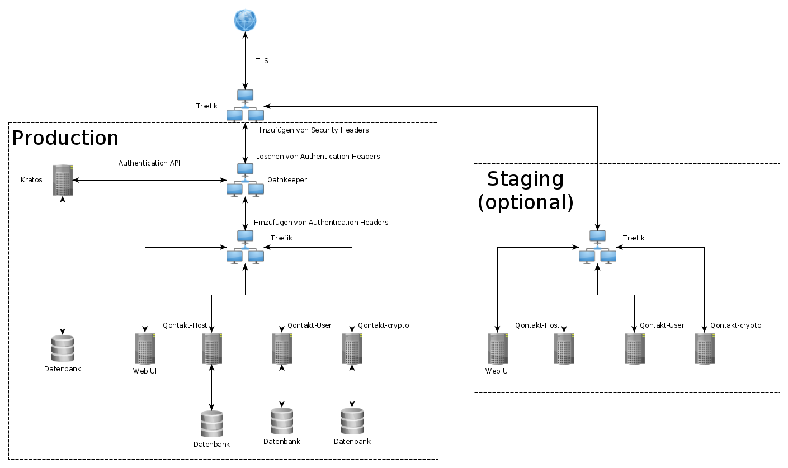

- [Qontakt](#qontakt)
  * [Verwendung](#verwendung)
    + [Aufgabe des Dienstes](#aufgabe-des-dienstes)
    + [Schnittstellenbeschreibung](#schnittstellenbeschreibung)
  * [Organisation](#organisation)
    + [Aufbau des Teams](#aufbau-des-teams)
    + [Aufgabenverteilung](#aufgabenverteilung)
  * [Vorgehen](#vorgehen)
    + [Verwendete Programmiersprache und Plattform](#verwendete-programmiersprache-und-plattform)
    + [Sicherheitsmechanismen](#sicherheitsmechanismen)
    + [Umsetzung der Services](#umsetzung-der-services)
      - [Nutzerdatenverwaltung](#nutzerdatenverwaltung)
      - [Lokalverwaltung](#lokalverwaltung)
      - [Verschlüsselung](#verschlüsselung)
    + [Umsetzung des Clients](#umsetzung-des-clients)
    + [Deployment](#deployment)
    + [Tests](#tests)

# Qontakt

> Im Rahmen der Lehrveranstaltung "Service and Cloud Computing" an der TU Dresden wurde
> Qontakt entwickelt, ein Web-Service zur Kontakt-Verfolgung. Dieser
> Proof-of-Concept wurde studentisch mit dem Ziel der
> Datensparsamkeit und -sicherheit unter Einhaltung der gesetzlichen
> Vorgaben als Antwort auf die öffentliche Tracing-Debatte konzipiert.
> Qontakt kann sowohl zentral als auch dezentral bereitgestellt werden.
> Auf diese Art und Weise kann jede akzeptierende Stelle selbst
> entscheiden, wie und wo die Nutzerdaten verwaltet werden sollen.

Achtung: Qontakt hat kein Datenschutz-Audit und befindet sich in einem Proof-of-Concept-Stadium.

Derzeit werden folgende Funktionen von unserer Anwendung unterstützt:
* Anlegen von Nutzerkonten
* Anlegen von Lokalen (öffentliche Orte, in denen sich ein Benutzer anmelden kann)
* Speichern von Besuchen von Nutzern in Lokalen durch pseudonymisierte Verknüpfung mit Start- und Endzeitpunkt des Besuches
* Pseudonymisierte Gültigkeitsprüfungen von Besuchen (damit der Besitzer eines Lokals überprüfen kann, dass ein Gast sich ordnungsgemäß angemeldet hat)
* Automatisches Löschen von Besuchen nach Ablauf der Aufbewahrungsfristen (derzeit max. 24 Stunden Verzögerung, Verzögerung kann verringert werden)
* Datenexport (ausschließlich verschlüsselt möglich, in Menschen- und Maschinenlesbare Formate)
* Entschlüsselung der exportierten Datensätze (Stub)

Folgende Funktionalität fehlt noch:
* Löschen von Nutzerkonten, wenn keine zu speichernden Daten nach §17, 3b DS-GVO mehr vorliegen (also nach Ablauf der jeweiligen Aufbewahrungsfrist)
* Datenbankverschlüsselung für Konformität mit §32, 1a DS-GVO
* Adressverifikation (damit sichergestellt werden kann, dass eingegebene Adressen gültig sind)
* Überprüfung durch eine öffentliche Stelle für Datenschutz (können wir uns finanziell nicht leisten)
* Speichern der kryptografischen Schlüssel der Gesundheitsämter (erfordert Kooperation, da diese nicht veröffentlicht wurden oder nicht existieren); Alternativ: Direkte Datenweitergabe an die Gesundheitsämter, per IRIS.

Folgende Funktionen sind noch verbesserungswürdig:
* Datensparsamkeit muss dahingehend verbessert werden, dass nur die für ein jeweiliges Bundesland erforderlichen Daten preisgegeben werden (derzeit wird das gesamte Nutzerprofil, bestehend aus Name, Anschrift, E-Mail-Adresse und Telefonnummer preisgegeben)
* Nutzererlebnis (wir sind keine erfahrenen Entwickler für Nutzeroberflächen; das sollte gegebenenfalls an eine spezialisierte Agentur ausgelagert werden) 

## Verwendung

###  Aufgabe des Dienstes

Ziel unserer Anwendung ist, die Gesundheitsämter bei der Nachverfolgung von Infektionsketten zu unterstützen. Hierfür sollen sich Nutzer im Rahmen der digitalen Kontaktdatennachverfolgung unter Einhaltung datenschutzrechtlicher Grundsätze bei jedem Aufenthalt in einem Lokal ein- und auschecken können.

### Schnittstellenbeschreibung

Für die Dokumentation der von unserem Dienst genutzten Schnittstellen haben wir Swagger verwendet. Eine Möglichkeit zum Ausprobieren der Funktionalitäten der einzelnen Services findet sich auf der ~~[Staging-Instanz](https://staging.qontakt.me)~~ (deaktiviert mangels Rechenleistung).

Wichtig ist die Unterscheidung, ob man intern oder extern gegen die API entwickelt. Für den internen Zugriff erfolgt die Authentifikation und Authorisierung auf Basis der Header `X-User` und `X-Lokal`. Von außen erfolgt die Authentifikation und Authorisierung auf Basis des Session-Cookies `ory_kratos_session`, welches unter Verwendung der Flows aus der [ORY/Kratos-Dokumentation](https://www.ory.sh/kratos/docs/self-service) unter dem Präfix `<BASE_URL>/.ory/kratos/public/` erzeugt werden kann. Von extern kann jeder Nutzer nur Aktionen ausführen, welche ausschließlich den Header `X-User` verwenden. Dieser Header wird automatisch intern hinzugefügt. Von extern eingehende Header `X-User` und `X-Lokal` werden gefiltert.

[OpenAPI-Dokument](openapi.yml)

Für jeden Service gibt es unter /api/v1/{crypto,host,user}/swagger-ui eine interaktive Schnittstelle, wenn er nicht auf production läuft. 

## Organisation

### Aufbau des Teams

Unser Team besteht aus Konstantin Köhring und Ylvi Sarah Bachmann. Wir belegen beide den Studiengang Bachelor Informatik an der TU Dresden.

In vorangegangenen Projekten konnten wir unterschiedlich viel Erfahrung bezüglich Spring Boot, Java und der Verwendung von Docker sammeln.

### Aufgabenverteilung

| Funktionalität                      | Entwickler        |
| ----------------------------------- | ----------------- |
| Nutzerdatenverwaltung               | Ylvi              |
| Identitätsmanagement                | Konstantin        |
| Lokalverwaltung und Datenauswertung | Konstantin        |
| GUI und Authentifikation            | Konstantin / Ylvi |
| Sicherheit                          | Konstantin / Ylvi |
| Analyse und Dokumentation           | Ylvi              |

## Vorgehen

### Verwendete Programmiersprache und Plattform

Wir verwenden für die Implementierung der Services zur Nutzerdaten-, Lokalverwaltung und Verschlüsselung Java und Spring Boot. Die Umsetzung des Frontends erfolgt mit JavaScript.

| Framework / Tool | Verwendung                                                   |
| ---------------- | ------------------------------------------------------------ |
| Swagger, OpenAPI | Schnittstellendokumentation                                  |
| Docker           | Komponiertes Deployment                                      |
| ORY/Kratos       | Authentifizierung                                            |
| ORY/Oathkeeper   | Authorisierung                                               |
| Traefik          | Präprozessierung, Shielding und TLS-Terminierung, sowie API-Gateway |
| BouncyCastle     | hybride Verschlüsselung von Dokumenten                       |

### Sicherheitsmechanismen

Da unsere Anwendung, um ihren Verwendungszweck zu erfüllen, schützenswerte Daten des Nutzers erfassen und speichern muss, haben wir Maßnahmen zum Schutze dieser ergriffen.

| Funktionalität                                               | Umsetzung                                                    |
| ------------------------------------------------------------ | ------------------------------------------------------------ |
| Speichern und Abrufen von Kontaktdaten des Nutzers           | Datensparsamkeit, Pseudonymisierung, Verteilte Datenspeicherung, Berechtigungsmanagement Später: Datenbankverschlüsselung |
| Speichern von Metadaten zu Besuchen                          | Zuverlässigkeit, Integrität, Datensparsamkeit                |
| Übermittlung von Besuchen und zugehörigen Nutzerdaten an Gesundheitsämter | Generierung einer verschlüsselten Datei mit hybridem Verschlüsselungsansatz |
| Kommunikation                                                | TLS-Terminierung, keine externen Quellen                     |

Die umgesetzten Schutzziele der Auth-Services sind in den jeweiligen Dokumentationen nachzulesen.

| Tool           | Dokumentation der Schutzziele                     |
| -------------- | ------------------------------------------------- |
| ORY/Kratos     | https://www.ory.sh/kratos/docs/concepts/security/ |
| ORY/Oathkeeper | Entwicklerseitig noch nicht vorhanden             |

### Umsetzung der Services

Unsere Anwendung haben wir mit Microservices umgesetzt (wobei diese letztendlich noch kleiner realisierbar gewesen wären). Einen zur Umsetzung der Funktionalitäten, welche den Nutzer (Besucher) eines Lokals und die Verwaltung bzw. Erfassung seiner Daten betreffen, einen weiteren zur Umsetzung der Funktionalitäten, welche dem Inhaber eines Lokals zur Verfügung stehen sollen und den dritten für die Verschlüsselung der Nutzerdaten bei einem Export. Außerdem gibt es noch einen extern bezogenen OSS-Authentifikationsdienst.

Sofern in den nachfolgenden Beschreibungen von Nutzerrollen gesprochen wird, sind immer die Rollen außerhalb der Anwendung gemeint, da diese keine Nutzerrollen implementiert.

#### Nutzerdatenverwaltung

Sämtliche Funktionalitäten, welche zur Nutzerdatenverwaltung benötigt werden, sind im Service `qontakt-user` zusammengefasst. Diese umfassen das Anlegen und Beenden eines Besuchs in einem bestimmten Lokal, die Erstellung eines QR-Codes mit den benötigten Daten zur Validierung eines Besuchs, sowie das Anzeigen aller Besuche eines Nutzers. Außerdem speichert dieser Service die nutzerspezifischen Kontaktattribute.

Da die Ansprüche der Corona-Verordnungen der Länder mit den Datenaufbewahrungsfristen größer wiegen als die Ansprüche des Nutzers, seine Daten gemäß DSGVO zu löschen, wird das Löschen eines Profils nur unter der Bedingung unterstützt, dass keine Besuche gespeichert sind. Dies genügt, da Besuche automatisch nach Ablauf der Speicherfrist gelöscht werden.

#### Lokalverwaltung

Im Service `qontakt-lokal` werden alle Details zu besuchbaren Orten ("Lokale") gespeichert. Außerdem ist hier der Bezug der Nutzerdaten zur Report-Generierung sowie die Löschung von Nutzerdaten nach der vorgeschriebenen Zeit implementiert.

#### Verschlüsselung

Der Service `qontakt-crypto` implementiert die Identitätsfunktion. Unter Verwendung eines öffentlichen RSA-Schlüssels wird ein hybrider Verschlüsselungsansatz für Dateien ausgeführt. Hierbei wird die Datei zuerst mit einem jeweils neu generierten AES-Schlüssel verschlüsselt, danach wird der AES-Schlüssel mit dem öffentlichen RSA-Schlüssel verschlüsselt und dem Ciphertext der Datei vorangestellt. Zum Entschlüsseln werden private RSA-Schlüssel mit und ohne Passwort unterstützt.

### Umsetzung des Clients

Für unsere Anwendung haben wir einen statischen Web-Client mit JavaScript entwickelt. Der Nutzer kann mit Hilfe eines Webbrowsers oder einer Progressive Web App auf unseren Dienst unter [Qontakt.me](https://www.qontakt.me) zugreifen.

### Deployment

Aktuell führen wir das Deployment manuell durch Ausspielen einer `docker-compose` per Docker Remote Access über TLS durch. Perspektivisch könnte dies durch Kubernetes erfolgen. Die Skalierung kann problemlos erfolgen, da lediglich die Datenbankebene stateful ist.

### Tests

Wir haben uns zuerst auf die Implementierung unseres Dienstes und danach auf die Umsetzung einer GUI konzentriert, weshalb nicht viel Zeit für umfangreiches Testen blieb. Dies war teilweise so von uns vorgesehen und auch in der Priorisierung der Aufgaben mit einberechnet. Unser eigentliches Ziel wäre es dennoch gewesen, die zu Grunde liegenden Funktionalitäten unserer Anwendung mit Unit-Tests abzudecken. Dies war leider auf Grund der Verzögerung des Projektstarts und des Mangels an verfügbarer Arbeitszeit durch das Ausscheiden des dritten Teammitglieds nicht möglich. Wir haben deshalb entschieden, dass wir unsere Anwendung manuell testen. Lediglich der Microservice `qontakt-crypto` wird automatisiert getestet.
